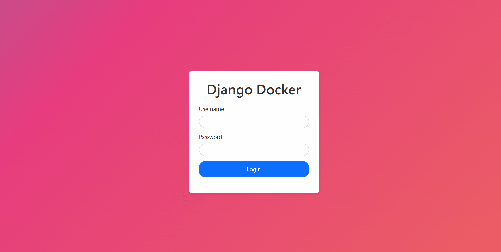

# Django Docker GUI



> Only support Linux-based machine because it uses Docker socket to interact with Docker daemon.

A simple SAAS web UI for managing Docker containers & images and interacting with using a fully functional terminal.

## Contains

- Django Web UI
- Web terminal
- Websocket for terminal & Docker events
- Async task queue for long running Docker tasks

## Usage

> Docker daemon must be running.

1. Run the following command to get the image build and run.

```
docker-compose up
```

2. Create a superuser for Django admin.

> Check the script `./dev-create-superuser.sh` and change the username and password if you want.

```
bash dev-create-superuser.sh
```

3. Go to http://localhost:8000, it will show the login page.

## Reference

This repo was refactored from [MahmoudAlyy/docker-django-ui](https://github.com/MahmoudAlyy/docker-django-ui).

## License

[MIT](./LICENSE)

